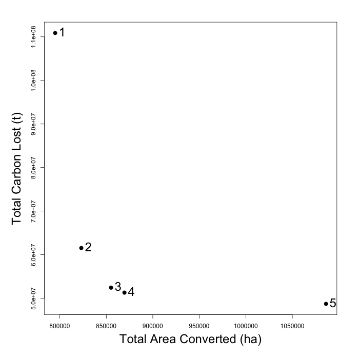

# agroEcoTradeoff

___Note___: ___This is the development branch. Instructions below are likely to be broken.___ 

A spatial tradeoff analysis model, focusing on minimizing the ecological costs of agricultural expansion.  Based on Koh and Ghazoul (2010). 

## Installation

Installation is in several steps. First, you should have installed already the following: 

  + R
  + Rstudio
  + gdal (mac users should get the frameworks from [kyngchaos](http://www.kyngchaos.com/software/frameworks), get the gdal complete framework)

Once you have those installed, download the full repository to your computer. From a unix command line, within a folder of your choosing, run either: 

```
> wget https://github.com/PrincetonUniversity/agroEcoTradeoff/archive/devel.zip
> unzip devel.zip
```

Or you can even do:

```
> git clone git@github.com:PrincetonUniversity/agroEcoTradeoff.git
```

Or you can just press the download zip button on github and unzip through your file explorer.  

Then within the folder tree of `agroEcoTradeoff`, find `installer.sh`, and execute that from the command line. 

```
> ./installer.sh
```

[insk file](https://www.dropbox.com/s/ncy76swgnhqx98h/ZA-mask.tif?dl=0)

[roads/parks file](https://www.dropbox.com/s/gwnt9svs6fwurah/parks_roads.rda?dl=0)

___Below here deprecated for time being___

If all went well, the model should work.  See `optimization-runner.Rmd` and `tradeoff-simulator.Rmd` for examples of how to run the model. 

## Demonstration

A key part of the model is to find optimal tradeoffs between different land use priorities, based on different impact metrics.  For example, the following presents the optimal solutions for balancing the interests in a) selecting the most productive land for new agricultural development b) minimizing carbon emissions due to land use change. Here the impact of a) is measured in terms of the total land converted to meet an agricultural production target, while b) is measured in terms of tons of carbon lost. Different weights are applied to each priority. 



In this example, point 1 represents 100% weighting on the maximizing productivity interest, while point 5 represents 100% interest in carbon conservation. Both of these points result in the worst outcomes for the other interest. In contrast, redirecting just 25% of the weight to either carbon conservation (point 2) or selecting the most productive land (point 4) produces nearly as much gain for each of those interests as applying 50-50 weighting (point 3).  

